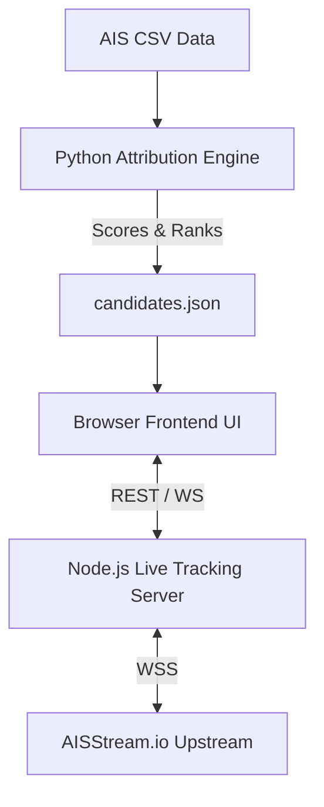

<div align="center">

# 🌊 AquaTrace

**Satellite Oil Spill Detection & AIS Vessel Correlation Engine**

[](https://opensource.org/licenses/MIT)
[](https://nodejs.org/)
[](https://www.python.org/)
[]()

AquaTrace combines **Sentinel-1 Synthetic Aperture Radar (SAR)** satellite imagery with **real-time AIS vessel trajectory data** to automatically detect marine oil slicks and produce ranked investigation candidates for human review.

</div>

---

## ✨ Key Features

- **📡 Real-Time Vessel Tracking:** Ingests live WebSocket AIS streams to track global ship movements.
- **🛰️ Oil Spill Correlation:** Cross-references SAR satellite imagery of oil slicks with historical AIS data.
- **⚖️ Attribution Engine:** 5-factor Python scoring model (Spatial, Temporal, Trajectory, Drift, Behavior) to identify the most likely polluter.
- **🗺️ Interactive Dashboard:** Beautiful, modular Leaflet + TailwindCSS frontend requiring no complex setup.

---

## 🏗️ System Architecture



---

## 🛠️ Tech Stack

- **Frontend:** HTML5, Vanilla JavaScript, TailwindCSS, Leaflet.js
- **Real-Time Backend:** Node.js, Express.js, `ws` (WebSockets)
- **Analytics Engine:** Python 3.9+, Pandas, NumPy

---

## 📂 Project Structure

```text
COMBINE/
├── frontend/                   # Modular web frontend (index.html, css/, js/)
├── aquatrace_ais/              # Python AIS Attribution Engine
├── live_track_ship/            # Node.js Real-time AIS Server
├── data/                       # AIS input data (CSV)
├── outputs/                    # Generated scoring results (candidates.json)
├── tests/                      # Frontend, Python, and Node.js tests
├── docs/                       # Architecture, Bug logs, and System checks
├── scripts/                    # Utility shell scripts
├── .env.example                # Environment variables template
└── README.md                   # You are here!
```

---

## 🚀 Quick Start

### 1. Start the Live Tracking Server (Node.js)

```bash
cd live_track_ship
npm install

# Set up environment variables
cp ../.env.example ../.env
# Edit ../.env and add your AISSTREAM_API_KEY

npm start
```
*Server runs at `http://localhost:3001`*

### 2. Run the Attribution Engine (Python)

```bash
cd aquatrace_ais
pip install -r requirements.txt

# Run the 5-factor scoring model
python run_attribution.py
```
*Results are saved to `outputs/attribution/candidates.json`*

### 3. Launch the Dashboard (Frontend)

Simply open `frontend/index.html` in your favorite web browser! No local development server required for the frontend.

---

## 🔧 Environment Variables

Copy `.env.example` to `.env` in the root directory and configure:

| Variable | Required | Default | Description |
|---|---|---|---|
| `AISSTREAM_API_KEY` | ✅ | — | Your AISStream.io API key |
| `PORT` | ❌ | `3001` | Backend HTTP server port |
| `VESSEL_STALE_TIMEOUT_MS` | ❌ | `7200000` | Stale vessel eviction timeout (ms) |

---

## 🤝 Contributing

We welcome contributions! Please see our [Pull Request Template](.github/PULL_REQUEST_TEMPLATE.md) for guidelines on submitting code.

## 📄 License

This project is licensed under the MIT License - see the [LICENSE](LICENSE) file for details.
