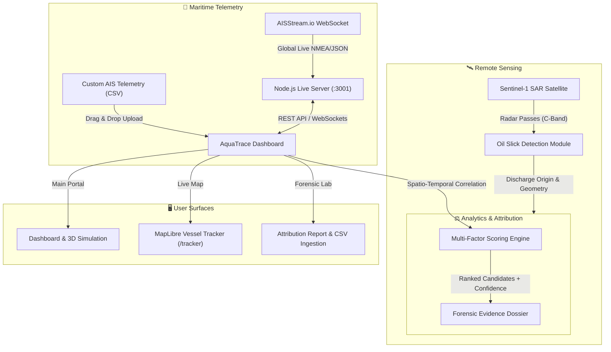

# 🌊 AquaTrace

<div align="center">

**Satellite Oil Spill Detection & AIS Vessel Correlation Engine**

[](LICENSE)
[](https://nodejs.org/)
[](https://www.python.org/)
[](https://threejs.org/)
[](https://maplibre.org/)

*AquaTrace leverages Sentinel-1 Synthetic Aperture Radar (SAR) imagery to automatically detect marine oil slicks, cross-referencing them against global AIS vessel telemetry to identify, score, and rank potential polluters.*

[Live Tracker](http://localhost:3001/tracker/) • [Attribution Engine](http://localhost:3001/attribution-report/ais-attribution.html) • [Dashboard](http://localhost:3001/)

</div>

---

## 📋 Table of Contents

- [Overview](#-overview)
- [Key Features](#-key-features)
- [System Architecture](#-system-architecture)
- [Attribution Scoring Algorithm](#-attribution-scoring-algorithm)
- [3D Maritime & Radar Simulation](#-3d-maritime--radar-simulation)
- [Tech Stack](#-tech-stack)
- [Project Structure](#-project-structure)
- [Getting Started](#-getting-started)
  - [Prerequisites](#prerequisites)
  - [Installation & Unified Startup](#installation--unified-startup)
  - [Running Subsystems Individually](#running-subsystems-individually)
- [CSV Ingestion & Forensic Workflow](#-csv-ingestion--forensic-workflow)
- [API & WebSocket Reference](#-api--websocket-reference)
- [Configuration](#-configuration)
- [License](#-license)

---

## 🎯 Overview

Marine oil pollution often goes unpunished due to vast oceanic coverage and deliberate vessel non-compliance (such as AIS transponder blackouts during bilge dumping). 

**AquaTrace** solves this problem by combining:
1. **Radar Remote Sensing:** Sentinel-1 C-band SAR satellite imagery that penetrates clouds and darkness to highlight slick damping anomalies.
2. **Global Real-Time AIS Telemetry:** Ingestion of live marine transponder streams across international shipping lanes.
3. **Forensic Attribution Engine:** A weighted, spatio-temporal mathematical correlation model that identifies and ranks suspect vessels with testable confidence scores.
4. **Interactive 3D WebGL Visualization:** A real-time physics-based maritime radar viewport rendering vessel hydrodynamics, ocean swells, and satellite scanning beams.

---

## ✨ Key Features

- **🛰️ Satellite SAR Slick Detection:** Analyzes radar backscatter damping signatures to locate oil discharge plumes.
- **🚢 Live Global AIS Vessel Tracking (`/tracker`):** MapLibre GL engine tracking tens of thousands of active vessels with cluster rendering, trajectory trails, and search by MMSI, IMO, or vessel name.
- **⚖️ Automated CSV Ingestion & Attribution Engine:** Drag-and-drop custom AIS CSV datasets to automatically compute candidate suspect lists, confidence ratings (`HIGH`, `MEDIUM`, `LOW`), and evidence dossiers.
- **🌊 Interactive 3D Maritime Simulation:** Three.js WebGL viewport in the dashboard featuring multi-octave Gerstner waves, vessel buoyant pitch/roll/heave physics, trailing foam wash, and volumetric satellite SAR sweep beams.
- **🎨 Token-Driven Structured UI:** Clean, high-contrast, accessible neo-brutalist dashboard styled with tokenized cream surfaces (`#F6F4EE`), stark black borders (`#111111`), dark navy contrast (`#0F2537`), and sky blue accents (`#00A8E8`).
- **📑 Forensic Incident Dossiers:** Generates detailed evidence reports with drift back-track vectoring, closest approach distances, time offsets, and AIS gap anomaly detection.

---

## 🏗️ System Architecture



---

## 📐 Attribution Scoring Algorithm

AquaTrace uses a composite multi-parameter evidence model to compute attribution scores ($0 - 100$) and assign testable confidence tiers:

$$\text{Attribution Score} = w_s S_{\text{spatial}} + w_t S_{\text{temporal}} + w_{tr} S_{\text{trajectory}} + w_d S_{\text{drift}} + w_b S_{\text{behavior}}$$

| Factor | Weight ($w$) | Analytical Description |
|---|---|---|
| **Spatial Proximity** ($S_{\text{spatial}}$) | **25%** | Haversine distance between vessel track points and the slick origin. Evaluates closest point of approach (CPA). |
| **Temporal Proximity** ($S_{\text{temporal}}$) | **25%** | Absolute time offset between vessel transit and estimated satellite radar slick detection time. |
| **Trajectory Alignment** ($S_{\text{trajectory}}$) | **20%** | Directional vector alignment between vessel heading/course-over-ground and the elongated slick axis. |
| **Drift Alignment** ($S_{\text{drift}}$) | **20%** | Proximity of vessel path to reverse-simulated ocean current and wind drift backtrack vectors. |
| **Behavioral Anomaly** ($S_{\text{behavior}}$) | **10%** | Detection of suspicious AIS transponder shutdowns (gaps $> 30$ min), sudden course deviations, or abnormal speed drops. |

### Confidence Tiers
- **HIGH CONFIDENCE ($\ge 70\%$)**: Strong multi-factor correlation; top suspect flag assigned with automated dossier generation.
- **MEDIUM CONFIDENCE ($45\% - 69\%$)**: Secondary candidate requiring investigator verification.
- **LOW CONFIDENCE ($< 45\%$)**: Peripheral vessel passing within search corridor but lacking proximate correlation.

---

## 🌊 3D Maritime & Radar Simulation

Integrated directly into the dashboard hero section:
- **Gerstner Trochoidal Waves:** Physical wave model with vertical and horizontal vertex displacements generating natural peaked wave crests and wide troughs.
- **Physical Water Shading:** `MeshPhysicalMaterial` with dynamic surface ripple normal maps, specular solar glints, and white seafoam crests on wave peaks.
- **Container Ship Anatomy (`MV SEAMARINER`):** Continuous naval architecture hull with flared bow, sheer curve, boot-topping waterline stripe, cargo hold coamings, stacked shipping containers, accommodation bridge with panoramic navigation windows, lifeboats, and dual rotating radar scanners.
- **Dynamic Buoyancy Physics:** Continuous sampling of water surface elevations under bow, stern, port, and starboard, yielding smooth buoyant heave, pitch, and roll with inertial mass damping.
- **Overhead SAR Beam:** Volumetric sky-blue scanning cone projecting from an orbiting Sentinel-1 satellite with expandable sweep pings.
- **Camera Views:** Instant toggling between **Tactical Isometric 3D**, **Bow Wave Chase**, and **Overhead SAR Satellite Orbit**.

---

## 🛠️ Tech Stack

- **Frontend:**
  - Modern HTML5, Modular JavaScript (ES6+)
  - **Three.js (r128)** for WebGL 3D Maritime Simulation
  - **MapLibre GL JS (v4.7.0)** for high-density GPU vessel map rendering
  - **Leaflet.js (v1.9.4)** for forensic incident trajectory maps
  - **TailwindCSS** + Vanilla CSS token design system
  - **FontAwesome 6** vector icon library
- **Backend:**
  - **Node.js (v18+)** & **Express.js**
  - **`ws`** for upstream and downstream AIS WebSocket streaming
  - In-memory vessel spatial indexing and stale record eviction
- **Analytics:**
  - **Python 3.9+** with **Pandas**, **NumPy**, and **SciPy** for offline batch attribution

---

## 📂 Project Structure

```text
AquaTrace/
├── frontend/                       # Main portal & dashboard
│   ├── index.html                  # Dashboard UI & 3D simulation
│   ├── css/                        # Tokenized CSS design system
│   │   ├── main.css                # Color variables & reset
│   │   ├── components.css          # Metric cards, tables, badges
│   │   ├── map.css                 # Leaflet layout styles
│   │   └── responsive.css          # Mobile / desktop breakpoints
│   └── js/                         # Frontend modules
│       ├── vessel3d.js             # Three.js 3D simulation engine
│       ├── map.js                  # Incident radar Leaflet map
│       ├── dashboard.js            # Live telemetry feeds & metrics
│       ├── attribution.js          # Forensic candidate cards
│       ├── news.js                 # Maritime alert bulletin
│       ├── modals.js               # Evidence dossier modals
│       ├── api.js                  # Backend client
│       └── config.js               # Global app configuration
├── live_track_ship/                # Real-time AIS tracking service
│   ├── public/                     # MapLibre live ship tracker app
│   │   └── index.html              # Fullscreen AIS tracking surface
│   └── src/                        # Node.js backend server
│       ├── server.js               # Express app & static server
│       ├── routes/api.js           # REST endpoints
│       └── services/aisService.js  # AISStream.io WebSocket ingest
├── docs/                           # Documentation & specialized reports
│   └── ais-attribution/            # Attribution lab & CSV ingestion
│       └── ais-attribution.html    # Standalone attribution engine
├── aquatrace_ais/                  # Python batch attribution suite
│   ├── run_attribution.py          # Standalone attribution runner
│   ├── src/                        # Scoring modules
│   └── requirements.txt            # Python dependencies
├── scripts/                        # Automation & startup scripts
│   └── start-all.js                # Unified one-command launcher
├── package.json                    # Workspace npm configuration
├── start.bat                       # Windows double-click launcher
└── README.md                       # Documentation
```

---

## 🚀 Getting Started

### Prerequisites

- [Node.js](https://nodejs.org/) (v18.0.0 or higher)
- [npm](https://www.npmjs.com/) (bundled with Node.js)
- Optional: Python 3.9+ (only if running the standalone Python attribution script)

### Installation & Unified Startup

1. **Clone the repository:**
   ```bash
   git clone https://github.com/drishyam27/AquaTrace.git
   cd AquaTrace
   ```

2. **Install dependencies:**
   ```bash
   npm install
   cd live_track_ship && npm install && cd ..
   ```

3. **Configure Environment Variables:**
   ```bash
   cp .env.example .env
   ```
   Open `.env` and add your free API key from [AISStream.io](https://aisstream.io/):
   ```env
   PORT=3001
   AISSTREAM_API_KEY=your_aisstream_api_key_here
   ```

4. **Launch the entire system:**
   ```bash
   npm start
   ```
   *(On Windows, you can also double-click `start.bat`)*

5. **Access the application:**
   - **Main Dashboard:** [http://localhost:3001/](http://localhost:3001/)
   - **Live Ship Tracker:** [http://localhost:3001/tracker/](http://localhost:3001/tracker/)
   - **Attribution & CSV Lab:** [http://localhost:3001/attribution-report/ais-attribution.html](http://localhost:3001/attribution-report/ais-attribution.html)

---

## 📥 CSV Ingestion & Forensic Workflow

Users can upload custom AIS historical files to attribute any detected spill to candidate ships:

1. Navigate to the **Attribution Lab** (`http://localhost:3001/attribution-report/ais-attribution.html`) or click **"Upload AIS CSV & Rank Candidate Ships"** from the dashboard.
2. Drag and drop any `.csv` file into the upload zone.
3. The engine automatically maps varied column names:
   - `MMSI`, `IMO`, `vessel_id`
   - `BaseDateTime`, `timestamp`, `datetime`, `date_time`
   - `LAT`, `latitude`, `LON`, `longitude`
   - `SOG`, `speed`, `COG`, `course`
   - `VesselType`, `VesselName`
4. **Auto-Centering:** The system automatically calculates the bounding spatial centroid and median timestamp of the dataset, establishing the search corridor and drift backtrack vector.
5. **Instant Testing:** Click **"Quick-Load Sample AIS Data"** to run an immediate test scenario, or **"Download Sample CSV"** to inspect a pre-formatted template.
6. The candidate list is generated with:
   - Ranked suspect ordering (#1 Top Suspect, #2, etc.)
   - Specific attribution scores ($0 - 100$)
   - Confidence score badges (`HIGH`, `MEDIUM`, `LOW`)
   - Interactive Leaflet satellite map plotting all vessel trajectories and search boundaries.

---

## 📡 API & WebSocket Reference

The Node.js server provides the following endpoints:

| Endpoint | Protocol | Description |
|---|---|---|
| `GET /api/vessels` | HTTP | Returns all currently active vessels within the bounding box |
| `GET /api/vessels/:mmsi` | HTTP | Returns latest telemetry and trajectory history for a specific MMSI |
| `GET /api/stats` | HTTP | Returns system status, active vessel counts, and ingestion rates |
| `WS /ws` | WebSocket | Real-time push stream broadcasting live vessel updates to connected clients |

---

## 🔧 Configuration

| Environment Variable | Default | Description |
|---|---|---|
| `PORT` | `3001` | HTTP and WebSocket server port |
| `AISSTREAM_API_KEY` | *None* | API key from AISStream.io for live global vessel feeds |
| `VESSEL_STALE_TIMEOUT_MS` | `7200000` | Eviction threshold (2 hours) for vessels with inactive transponders |

---

## 📄 License

This project is open-source and distributed under the **MIT License**. See the [LICENSE](LICENSE) file for more information.
