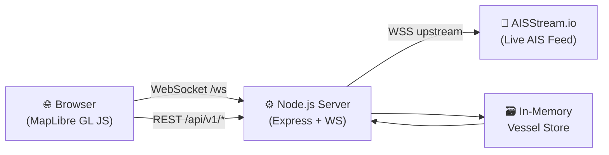

<div align="center">

# 🚢 ShipTrack — Live AIS Vessel Tracker

**Real-time global ship tracking powered by AISStream.io**

[](https://nodejs.org/)
[](https://expressjs.com/)
[](https://maplibre.org/)
[](https://developer.mozilla.org/en-US/docs/Web/API/WebSockets_API)
[](LICENSE)

Track thousands of vessels across the world's oceans in real time.  
AIS data is streamed via WebSocket, processed server-side, and rendered on a high-performance interactive map.

</div>

---

## 📸 Preview

> Open `http://localhost:3001` after starting the server to see the live map.

---

## 🏗 Architecture



**Data Flow:**

1. The **Node.js backend** connects upstream to [AISStream.io](https://aisstream.io) via WebSocket.
2. Incoming AIS messages (position reports, static data) are **normalized**, **deduplicated**, and stored in a canonical in-memory vessel store.
3. Connected **browser clients** receive batched vessel updates over WebSocket every 200ms.
4. A full **REST API** is available for programmatic queries — search vessels, fetch tracks, check health.

---

## ✨ Features

| Category | Details |
|----------|---------|
| **Live Map** | Full-screen interactive world map with MapLibre GL JS + CartoDB vector tiles |
| **Real-time Streaming** | Live AIS vessel positions via WebSocket with 200ms batched broadcasts |
| **Vessel Classification** | Color-coded markers by type — Cargo, Tanker, Passenger, Fishing, Tug, Military, SAR, Pleasure, Pilot |
| **Directional Markers** | Vessel icons rotate by true heading or COG at zoom ≥ 7 |
| **Search** | Instant search across vessel name, MMSI, IMO, callsign, and destination |
| **Detail Panel** | Click any vessel for rich metadata — dimensions, voyage, AIS technical data, raw JSON |
| **Track History** | Historical breadcrumb trails showing vessel trajectory (up to 120 points) |
| **Filters** | Filter by vessel category and minimum speed threshold |
| **Map Styles** | Toggle between Light, Dark, and Satellite imagery basemaps |
| **Auto-reconnect** | Exponential backoff reconnection for both upstream and downstream WebSockets |
| **Viewport Subscription** | Only subscribes to AIS data for the user's current map viewport |
| **REST API** | Full `/api/v1` endpoints for health, stats, vessel search, and track retrieval |
| **Responsive** | Adapts to mobile screens with collapsible panels |

---

## 🎨 Vessel Categories & Colors

| Category | Color | AIS Type Codes |
|----------|-------|----------------|
| Cargo | 🔵 Blue | 70–79 |
| Tanker | 🔴 Red | 80–89 |
| Passenger | 🟣 Purple | 60–69 |
| Fishing | 🟠 Orange | 30 |
| Tug | 🟡 Yellow | 52 |
| Military | 💜 Violet | 35 |
| SAR | 🩵 Cyan | 51, 61 |
| Pleasure | 🩷 Pink | 36–39 |
| Pilot | 🟡 Amber | 50 |
| Unknown | 🟢 Green | — |
| Other | ⚪ Gray | All remaining |

---

## 🚀 Quick Start

### Prerequisites

- [Node.js](https://nodejs.org/) ≥ 18.x
- Free API key from [AISStream.io](https://aisstream.io)

### Installation

```bash
# Clone the repository
git clone https://github.com/zaidsamii/shiptrack-live-ais.git
cd shiptrack-live-ais

# Install dependencies
npm install

# Configure environment
cp .env.example .env
# Edit .env and set your AISSTREAM_API_KEY
```

### Running

```bash
# Production
npm start

# Development (auto-restart on file changes)
npm run dev
```

Open **http://localhost:3001** in your browser — you'll see the live map.

---

## 📁 Project Structure

```
shiptrack-live-ais/
├── public/                         # Static frontend assets
│   └── index.html                  # MapLibre GL interactive map UI
├── src/                            # Backend source code
│   ├── config/
│   │   └── constants.js            # Vessel types, nav status codes, coordinate helpers
│   ├── providers/
│   │   └── aisstream.js            # AISStream.io upstream WebSocket client
│   ├── routes/
│   │   └── api.js                  # Express REST API router (/api/v1)
│   ├── services/
│   │   ├── vesselStore.js          # Canonical vessel store, dedup, track history
│   │   └── broadcastService.js     # Client viewport sync & WebSocket broadcasting
│   └── server.js                   # Application entry point & orchestrator
├── docs/                           # Engineering documentation
│   ├── SYSTEM_CHECK.md             # System audit & validation report
│   ├── BUG_LOG.md                  # Known issues & resolution log
│   └── IMPLEMENTATION_NOTES.md     # Architecture & implementation notes
├── tests/                          # Integration tests
│   └── test_client.js              # WebSocket integration test client
├── .env.example                    # Environment variable template
├── .gitignore                      # Git ignore patterns
├── package.json                    # Project metadata & scripts
├── server.js                       # Root entrypoint (delegates to src/server.js)
└── README.md                       # This file
```

---

## 🔌 API Reference

All REST endpoints are available at `http://localhost:3001/api/v1`.

### Health & Stats

| Method | Endpoint | Description |
|--------|----------|-------------|
| `GET` | `/api/v1/health` | Server health check (status, uptime, vessel count) |
| `GET` | `/api/v1/stats` | Live telemetry (total updates, connection status, timestamps) |

### Vessels

| Method | Endpoint | Description |
|--------|----------|-------------|
| `GET` | `/api/v1/vessels` | All active vessels with valid coordinates |
| `GET` | `/api/v1/vessels/search?q=QUERY` | Search by name, MMSI, IMO, callsign, or destination |
| `GET` | `/api/v1/vessels/:mmsi` | Detailed vessel profile by MMSI |
| `GET` | `/api/v1/vessels/:mmsi/track` | Historical trajectory breadcrumb trail |

### WebSocket

Connect to `ws://localhost:3001/ws` for real-time vessel streaming.

**Inbound Messages (client → server):**

```json
{ "type": "UPDATE_VIEWPORT", "data": { "north": 60, "south": 35, "east": 30, "west": -10 } }
```

**Outbound Messages (server → client):**

| Type | Description |
|------|-------------|
| `INITIAL_VESSELS` | Full vessel snapshot on connection |
| `VESSEL_UPDATE_BATCH` | Batched position/metadata updates (every 200ms) |
| `VESSEL_REMOVED` | Stale vessel evicted from store |
| `MAP_STATS` | Live telemetry counters |
| `CONNECTION_STATUS` | Upstream AIS provider connection state |

---

## ⚙️ Environment Variables

| Variable | Required | Default | Description |
|----------|----------|---------|-------------|
| `AISSTREAM_API_KEY` | ✅ Yes | — | Your AISStream.io API key |
| `PORT` | No | `3001` | HTTP server port |
| `VESSEL_STALE_TIMEOUT_MS` | No | `7200000` | Stale vessel eviction timeout (ms) |
| `NODE_ENV` | No | `development` | Application environment |

---

## 🧪 Testing

```bash
# Start the server first, then in another terminal:
npm run test:client
```

The test client connects via WebSocket, subscribes to Europe and India viewports sequentially, and reports unique vessel counts.

---

## 📊 Data Quality Indicators

| Quality | Criteria | Meaning |
|---------|----------|---------|
| 🟢 **LIVE** | Position < 1 min old | Active real-time tracking |
| 🟡 **RECENT** | Position < 5 min old | Recent but not live |
| 🟠 **STALE** | Position < 30 min old | Data may be outdated |
| 🔴 **OFFLINE** | Position > 30 min old | Vessel likely out of range |

---

## 🛡 Security

- **API keys are never exposed to the browser.** The AISStream API key is loaded server-side from `.env` and used only in the upstream WebSocket connection.
- The `.env` file is excluded from version control via `.gitignore`.
- All sensitive configuration is managed through environment variables.

---

## 📄 License

This project is licensed under the [MIT License](LICENSE).

---

<div align="center">

**Built with ❤️ by [zaidsamii](https://github.com/zaidsamii)**

</div>
